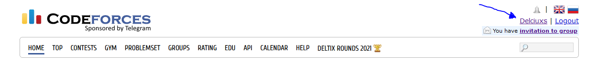
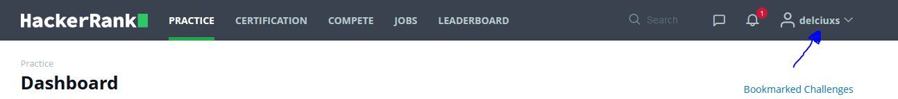
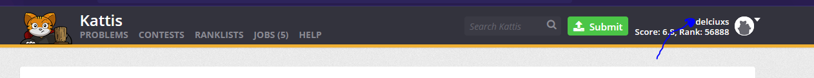

# Thesis Judge

[](https://github.com/tterb/atomic-design-ui/blob/master/LICENSEs)

API system to submit code to online judges.

## Authors

- [@akotadi](https://www.github.com/akotadi)
- [@Delciuxs](https://github.com/Delciuxs)

## License

[MIT](https://choosealicense.com/licenses/mit/)

## Setup

To run the app you need to ```npx ts-node ./API/server.ts``` but first you need to create a file **appconfig.json** in the root folder, this file should contain the following keys:

#### appconfig.json

```json
{
  "port": 3000,
  "x-auth-token": "",
  "veredictTimeOut": 20,
  "actionsTimeOut": 10,
  "availableAccountTimeOut" : 30,
  "onlineJudges": [
    "codeforces",
    "hackerrank",
    "kattis"
  ],
  "judgeAccounts": {
    "user1" : {
      "nickname": "YOUR NICKNAME FOR USER 1",
      "password": "YOUR PASSWORD FOR USER 1"
    },
    "user2" : {
      "nickname": "YOUR NICKNAME FOR USER 2",
      "password": "YOUR PASSWORD FOR USER 2"
    }
  }
}
```

##### Explanation for **appconfig.json**

- ***port***: *(number)* The port in which the app is running.
- ***x-auth-token***: *(string)* If you want your API to be protected, type here a secret token. If that is the case, then you should provide *x-auth-token* header field in **every** API request.
- ***veredictTimeOut***: *(number)* Timeout in **seconds** that the API should wait at most, to get a veredict *(AC, WA, CPE, RTE, TLE, MLE)* of a problem sent to any online judge.
- ***actionsTimeOut***: *(number)* Since the API uses a bot to login and sent a specific problem to an online judge, the bot applies diferent actions such as click, wait for selectors, load page, etc. Specify a Timeout in **seconds** for this actions.
- ***onlineJudges***: *(array<strings>)*: Specify here the online **judges** that are **supported**.
- ***judgeAccounts***: *(object<objects>)*: Here is were you should specify the accounts that the bot can use to login and sent a problem to an online judge.  
***Important:*** *Add all the accounts you want using the example above, if you want to add another account, add a new object, example: **'user3: {nickname: "", password: ""}'** the **accounts must be created with anticipation in every online judge**, it is important that the **username and password is shared** within the online judges*

**One final note:**
The **nickname** that is specified in every judgeAccount, should be a unique identifier that appears when you login in the different platforms. The bot uses that nickname to know if he is logged in.
*Example:*
```json
{
  "judgeAccounts": {
    "user1" : {
      "nickname": "delciuxs",
      "password": "123456"
    },
  }
}
```
- Codeforces:

- Hackerrank:

- Kattis:


## API Usage

If in the configuration file the ***x-auth-token*** **is set** to something rather than empty string, then every request should provide that header with the token in order to get authorization to content.

```
x-auth-token: YOUR_CUSTOM_TOKEN
```

#### GET

- Get supported Languages

Endpoint
```
/languages
```
- Get supported Judges
 
Endpoint
```
/judges
```

#### POST

- Submit solution to an online judge

Endpoint
```
/submit:base64_encoded={true | false}
```
Headers
```
Content-Type: application/json
```
Body
```json
{
  "problemURL": "https://open.kattis.com/problems/hello",
  "langSolution": "python3",
  "solution": "print('Hello World')"
}
```
*Note*: If the parameter **base64_encoded** is set to true, then the solution in the body must be base64 encoded.